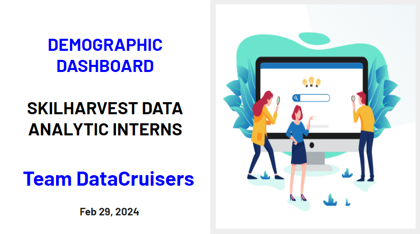

  <table style="margin-left:auto; margin-right:auto; border-collapse: collapse">
    <tr>
      <td align="left" style="border: none">
        
      </td>
      <td align="center" style="border: none">
        <h1>DEMOGRAPHIC DASHBOARD SKILHARVEST DATA ANALYTIC INTERNS                                                                                                                                                                              </h1>
      </td>
    </tr>
  </table>

  

## Project Overview
This is my first capstone project from the SkilHarvest DataAnalytics Bootcamp. It entails an in-depth analysis of demographic and professional data collected from participants enrolled in the Bootcamp 2023-2024.

  

## Project Objective:
The objective of the Demographic Dashboard project was to gather comprehensive insights into the demographics and interests of interns participating in the SkilHarvest Data Analytics Bootcamp program.

## Data Collection:
- Data was collected primarily through the distribution of a Google Form questionnaire among participating interns.
- The questionnaire captured a range of information, including personal details, academic qualifications, professional background, interests, and preferences related to data analytics training.
- Carefully crafted to ensure clarity and ease of completion, the form was shared with interns via email with a clear deadline for response submission.
- You can find the google questionaire [Here](https://bit.ly/SkilHarvestClassData) and the form responses at [Data](https://docs.google.com/spreadsheets/d/1j683Iej1rexP0ZklCt4CQSEjTZpUGAfhIirowQNtk80/edit?resourcekey#gid=120058417)

[Presentation Slide](https://docs.google.com/presentation/d/1hi_Z7c0v6xgI5BJ28VIZEHYDwbsxOoARtKH0aU4lLuE/edit#slide=id.g2bde3e191d5_2_1519)
- 

### Compliance & Confidentiality:
- All data collection procedures adhered to ethical guidelines and data protection regulations.
- Respondents were assured of the confidentiality and anonymity of their responses to foster trust and encourage honest feedback.

### Data Preprocessing Techniques:
- Addressed data type inconsistencies, missing values, and text manipulations to ensure data integrity and consistency.
- Employed feature engineering techniques to derive meaningful insights from the data.

### Results and Observations:
1. Representation of interns by qualification: SSCE and ND qualifications were found to be underrepresented, comprising only 4.7% of the total cohort.
2. Gender neutrality in upskilling interest: Gender does not appear to play a significant role in determining interest in learning data analytics, with a fairly balanced gender distribution among interns.
3. Interest in data analytics across professions: Notable interest in data analytics was observed among students, engineers, teachers, and individuals with similar job roles to data analysts, collectively comprising 44.2% of the intern population.
4. Interns Engagement: The survey form experienced a peak in responses within the first 4 minutes, suggesting prompt and engaged responses from interns.
5. Upskilling interest and demographic factors: An observable relationship was found between upskilling interest, age group, and academic qualifications.

### Recommendations:
1. Targeted outreach for underrepresented groups.
2. Foster collaborative partnerships with educational institutions, professional organizations, and industry stakeholders.
3. Develop tailored training programs catering to specific demographic needs.
4. Diversify marketing channels and timing strategies to ensure broader reach.

