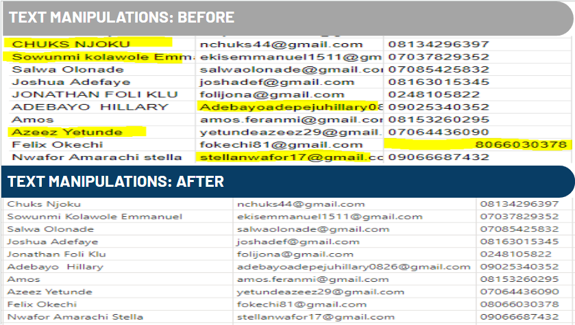
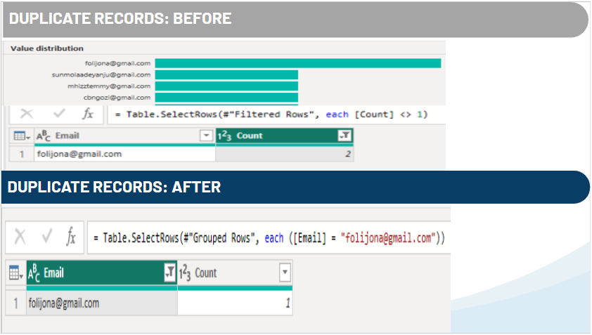
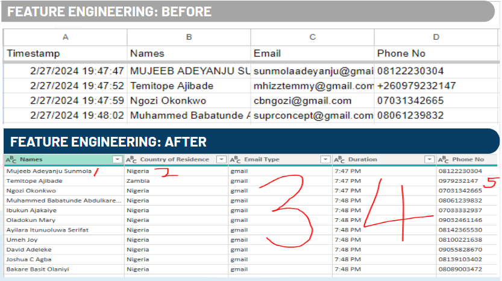
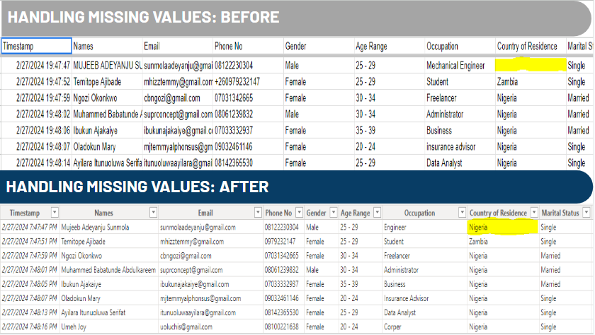

  <table style="margin-left:auto; margin-right:auto; border-collapse: collapse">
    <tr>
      <td align="left" style="border: none">
        
      </td>
      <td align="center" style="border: none">
        <h1>DEMOGRAPHIC DASHBOARD FOR SKILHARVEST DATA ANALYTIC INTERNS                                                                                                                                                                              </h1>
      </td>
    </tr>
  </table>

  

## PROJECT OVERVIEW
This is my first capstone project from the SkilHarvest Data Analytics Bootcamp, serving as the team lead for a group effort. It entails an in-depth analysis of demographic and professional data collected from participants enrolled in the Bootcamp 2023-2024

## MEET THE TEAM

  

## PROJECT OBJECTIVE
The objective of the Demographic Dashboard project was to gather comprehensive insights into the demographics and interests of interns participating in the SkilHarvest Data Analytics Bootcamp program.

## TOOLS & TECHNOLOGIES
1. **Google forms:** For collecting data
2. **Google sheets:** For storing data
3. **PowerBI:** For data cleaning & Visualisation
4. **Google Slide:** For project presentation

## DATA COLLECTION
|THE STAGES OF DATA COLLECTION|
|-----------------------------|
|1. Data was collected primarily through the distribution of a Google Form questionnaire among participating interns.|
|2. The questionnaire captured a range of information, including personal details, academic qualifications, professional background, interests, and preferences related to data analytics training.|
|3. Carefully crafted to ensure clarity and ease of completion, the form was shared with interns via email with a clear deadline for response submission.|
|4. We made sure that all data collection procedures adhered to ethical guidelines and data protection regulations.|
|5. In addition, respondents were assured of the confidentiality and anonymity of their responses to foster trust and encourage honest feedback.|
|6. Download the google questionaire that was used [here](https://bit.ly/SkilHarvestClassData) and the form responses at [data](https://docs.google.com/spreadsheets/d/1j683Iej1rexP0ZklCt4CQSEjTZpUGAfhIirowQNtk80/edit?resourcekey#gid=120058417)|

## DATA CLEANING & PREPROCESSING TECHNIQUES
This section outlines the data preprocessing techniques employed to clean and prepare the dataset for analysis. Each technique addresses specific issues such as data type standardization, correcting data uniqueness, text manipulations, checking for duplicate records, feature engineering, and handling missing value

### 
 Data Type Standardization 

- **Timestamp Column:** Updated data type from "TIMESTAMP" to "DATETIME" for consistency.
- **Remaining Columns:** Standardized data types from "ANY" to "TEXT" for uniformity

### 
<strong>Correct for Data Uniqueness</strong>

- **Trimming:** Removed leading & trailing spaces from "Occupation" and "Country" columns.
- **Capitalization:** Capitalized each word in the "Occupation" column for normalization.
- **Replacement:** Replaced specific occupation values with more generic terms for consistency. For instance, replaced __"Business Man"__ with __"Business"__, __"Nysc"__ with __"Corper"__ for consistencies and standardized all engineering occupations variations by replacing them with __"Engineer."__

### 
 Text Manipulations 

- **Email Column:** Trimmed leading and trailing spaces, converted to lowercase.
- **Name Column:** Trimmed leading and trailing spaces, capitalized each word.
- **Phone Column:** Replaced inconsistent formats **("8066030378" & "081 3336 055 6")** with standardized ones **("08066030378" & "08133360556")**.

  

### 
 Check for Duplicate Records 

- **Duplicate Removal:** Removed duplicate records associated with **"Jonathan Foli Klu."**

  

### 
 Feature Engineering 

- **New Column Creation:** Created "Email Type" based on existing email data.
- **Timestamp Classification:** Derived "Duration" column representing time elapsed since a specific timestamp.

  

### 
 Handling Missing Values 

- **Country Column:** Imputed missing values using the mode value.

  

### RESULTS & OBSERVATIONS
|RESULTS AND OBSERVATIONS|
|--------------------------|
|**1. Representation of interns by qualification** SSCE and ND qualifications were found to be underrepresented, **comprising only 4.7% of the total cohort**.|
|**2. Gender neutrality in upskilling interest** Gender does not appear to play a significant role in determining interest in learning data analytics, with a fairly balanced gender distribution among interns.|
|**3. Interest in data analytics across professions** Notable interest in data analytics was observed among students, engineers, teachers, and individuals with similar job roles to data analysts, collectively **comprising 44.2% of the intern population**.|
|**4. Interns Engagement** The survey form received a significant spike in responses **within the first 4 minutes**, indicating prompt and engaged participation from interns. Approximately **80% of the participants responded within this initial timeframe**|
|**5. Upskilling interest and demographic factors** A notable correlation exists between upskilling interest, age group, and academic qualifications. Young individuals aged 20-34 show a heightened interest in data analysis upskilling, representing approximately **84% of participants at the SkilHarvest data analysis bootcamp**.  Similarly, individuals with higher academic qualifications demonstrate a greater inclination towards data analysis compared to those with lower qualifications, **comprising about 95% of participants**. This trend may be attributed to increased exposure|
||

  

More so, you can downlaod my group presentation slide [here](https://docs.google.com/presentation/d/1hi_Z7c0v6xgI5BJ28VIZEHYDwbsxOoARtKH0aU4lLuE/edit#slide=id.g2bde3e191d5_2_1519)

### RECOMMENDATIONS
1. Targeted outreach for underrepresented groups.
2. Foster collaborative partnerships with educational institutions, professional organizations, and industry stakeholders.
3. Develop tailored training programs catering to specific demographic needs.
4. Diversify marketing channels and timing strategies to ensure broader reach.

